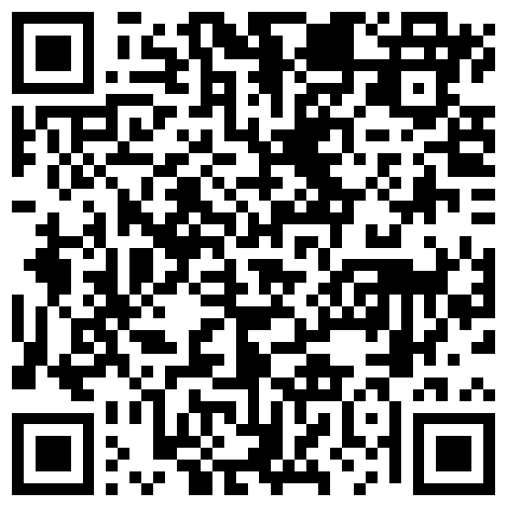

<a href="#inizio">Per iniziare</a>

---

<div align="center">

# PREVIEW
</div>

#### premere il qr code o scansionarlo

<a href="https://mattiaortolani-disney-clone.vercel.app/">
    
</a>

---

<div align="center" id="inizio">

# PER INIZIARE
</div>

incolla la seguente stringa nel terminale per clonare il repository:

```
git clone https://github.com/MattiaOrtolani/Disney.git
```

dopo averlo clonato è necessario installare le dipendenze (Sass e Typescript) con il seguente comando:

```
npm install
```

dopo aver installato le dipendenze, per compilare il progetto eseguire il seguente comando:

```
npm run build
```

in questo modo compilerà sia il codice SCSS che Typescript in codice CSS (minificato) e JS

<a href="#home">Torna all'inizio</a>